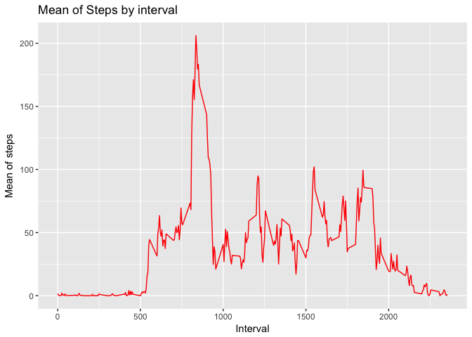
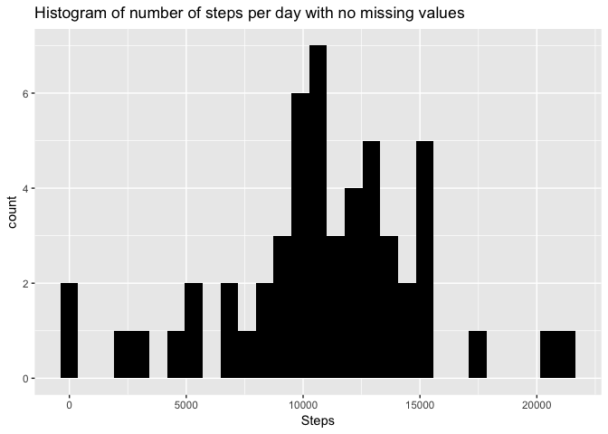
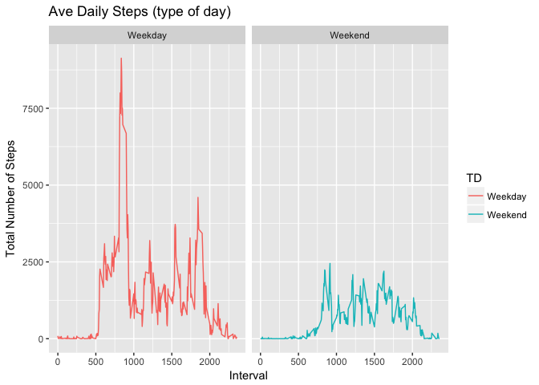

# Reproductible Research Project
1. First we need to read the file we do this by downloading it and unziping the document

```r
download.file("https://d396qusza40orc.cloudfront.net/repdata%2Fdata%2Factivity.zip",destfile = "temp.zip")
unzip("temp.zip")
datos<-read.csv("activity.csv")
```
2. After reading the file we need to generate the histogram plot code hiden

```r
library(ggplot2)
datosdia<-aggregate(steps~date,datos,sum)
qplot(datosdia$steps,geom = "histogram",fill=I("black"),binwidth=760,main="Histogram of number of steps per day")
```

<!-- -->
3. Now we calculate the mean and the median of the steps by day the code is hiden

```r
promedio<-as.double(mean(datosdia$steps))
mediana<-median(datosdia$steps)
```
* the median was 10765 and the mean was 1.0766189\times 10^{4}.  

4. Now we aggregate the data by interval ad we graph interval against plot

```r
library(ggplot2)
agregadoi<-aggregate(steps~interval,datos,FUN=mean,na.rm=T)
maximo<-agregadoi$interval[which.max(agregadoi$steps)]
qplot(agregadoi$interval,agregadoi$steps,geom = "line",main = "Mean of Steps by interval",xlab = "Interval",ylab = "Mean of steps",color=I("red"))
```

<!-- -->
* the interval that shows the higher step mean is: 835    
5. Code to impute missing values  

```r
datoslimpios<-datos[!is.na(datos$steps),]
datoslimpios<-aggregate(steps~date,datoslimpios,sum)
#Steps per day after imputing missing values
qplot(datoslimpios$steps,geom = "histogram",fill=I("black")
        ,main="Histogram of number of steps per day with no missing values", binwidth=760,xlab = "Steps")
```

<!-- -->
  
6. Need to ask the week day and generate new column

```r
datos$TD<-ifelse(weekdays(as.Date(datos$date))=="Saturday"|weekdays(as.Date(datos$date))=="Sunday","Weekend","Weekday")
DI<-aggregate(steps~interval+TD,datos,sum,n.rm=T)
ggplot(DI, aes(x =interval , y=steps, color=TD)) +geom_line() +labs(title = "Ave Daily Steps (type of day)", x = "Interval", y = "Total Number of Steps")+facet_wrap(~ TD, ncol = 2, nrow=1)
```

<!-- -->

